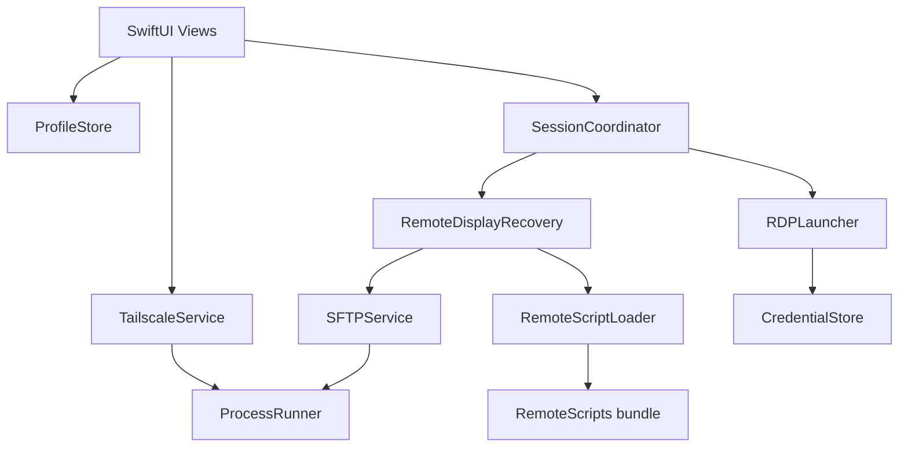

# TailRDP Handover

Developer reference for the TailRDP macOS app (`app.tailrdp`). For user-facing docs see [USER_GUIDE.md](USER_GUIDE.md). For build/test workflow see [CONTRIBUTING.md](CONTRIBUTING.md).

---

## Table of contents

1. [Architecture](#architecture)
2. [Session lifecycle](#session-lifecycle)
3. [Linux recovery](#linux-recovery)
4. [Data and persistence](#data-and-persistence)
5. [Logging](#logging)
6. [Remote scripts](#remote-scripts)
7. [Concurrency](#concurrency)
8. [Module map](#module-map)
9. [Phased history](#phased-history)
10. [Verify commands](#verify-commands)
11. [Deferred / roadmap](#deferred--roadmap)
12. [Known limits](#known-limits)

---

## Architecture



| Component | Role |
|-----------|------|
| `TailscaleService` | `tailscale status --json` → peers; `@MainActor`, refresh in `Task.detached` |
| `ProfileStore` | `profiles.json`, merge discovery, flash/sticky banners, export/import |
| `RDPLauncher` | Build FreeRDP argv (`/p:` password, `/cert:tofu`), track process, generation counter |
| `SessionCoordinator` | Connect orchestration, session end handling, adaptive Linux delay |
| `SessionEndClassifier` | Pure classify: pause / logout / crash from exit code + stderr |
| `RemoteDisplayRecovery` | SSH recovery presets, tri-state remote session |
| `RemoteScriptLoader` | Load bundled scripts with SHA256 pins |
| `CredentialStore` | `credentials.json` (0600); one-time Keychain import |
| `AppLog` | OSLog subsystem `app.tailrdp` |

**Design principle:** pure logic (`SessionEndClassifier`, `chooseRecovery`) is testable without I/O. Blocking work (`ProcessRunner`, SSH) runs in `Task.detached`. UI state on `@MainActor`.

---

## Session lifecycle

### Connect (`SessionCoordinator.connect`)

1. Optional **adaptive Linux resume delay** (`SessionHealth.linuxResumeDelayMs`, 1500–8000 ms).
2. **Pre-connect heal** only if prior end was **crash** + `smartReconnect` + Linux.
3. Choose settings: safe fallback, last-good snapshot, or current profile settings.
4. `RDPLauncher.launch` — terminate orphan clients (`pkill` + 250 ms), bump `sessionGeneration`, run FreeRDP.

On successful Linux resume: delay **decays** 500 ms (floor 1500). On failed resume connect: delay **increases** 1500 ms (cap 8000).

### Session end (`RDPLauncher` termination handler)

1. Read stderr, exit code, user-initiated disconnect flag.
2. `SessionEndClassifier.classify` → `SessionEndKind`.
3. Post `SessionEndNotice`; `ContentView` shows optimistic banner immediately.
4. `SessionCoordinator.handleSessionEnd` (async, `sessionEndGeneration` guard):
   - **loggedOut** — clear health, flash “Disconnected”
   - **paused** — Linux SSH check: active → paused; inactive → loggedOut; SSH fail → paused + `sshUnverified`
   - **crashed** — optional SSH recovery preset, increment failures, sticky error banner

### Race mitigation

| Mechanism | Location | Purpose |
|-----------|----------|---------|
| `sessionGeneration` | `RDPLauncher` | Ignore stale FreeRDP termination after relaunch |
| `sessionEndGeneration` | `ContentView` | Ignore stale async `handleSessionEnd` after rapid reconnect |
| `terminateClients` + pkill | `RDPLauncher` | Kill orphan FreeRDP before new connect |
| Linux resume delay | `SessionCoordinator` | Wait for GNOME RDP socket teardown |

### Classifier highlights (`SessionEndClassifier`)

| Input | Result |
|-------|--------|
| User Disconnect | `loggedOut` |
| Exit 131, 130, 143, … (window close) | `paused` |
| `ERRINFO_LOGOFF_BY_USER` | `paused` (may become `loggedOut` after Linux SSH) |
| Signal / non-zero unexpected | `crashed` |
| Exit 24 / auth strings | `crashed` + auth message |

---

## Linux recovery

### Remote session state (tri-state)

| State | Meaning |
|-------|---------|
| `active` | `loginctl` shows remote Wayland session for SSH user |
| `inactive` | No matching remote session |
| `unknown` | SSH inspect failed |

### Recovery presets (`chooseRecovery`)

| Preset | When |
|--------|------|
| `none` | Benign disconnect (LOGOFF_BY_USER, etc.) |
| `endStuckSessions` | Multiple remote session IDs |
| `resetRemoteDesktop` | SEGV / gnome-shell signal in journal |
| `useSafeClientSettings` | ≥2 consecutive failures |

**Never** runs recovery on pause or logout — only crash path and explicit Advanced actions.

### Session picker

When resuming Linux with `remoteSessionIDs.count > 1`, `HostDetailView` shows `RemoteSessionPickerSheet`. Selected session is kept; others terminated via `terminate_sessions.sh` with `TAILRDP_EXCEPT_SESSION`.

---

## Data and persistence

| Item | Storage |
|------|---------|
| Profiles | `~/Library/Application Support/TailRDP/profiles.json` |
| Passwords | `~/Library/Application Support/TailRDP/credentials.json` (mode 0600), keyed by profile `id` |
| Legacy passwords | One-time migrate from Keychain service `app.tailrdp` → file, then delete Keychain items |
| Flash banners | In-memory only (`ProfileStore.flashBanners`) |
| Sticky banners | Persisted on `HostProfile.stickyBanner` |
| Session health | `HostProfile.sessionHealth` (failures, last end kind, resume delay ms) |
| App settings | `UserDefaults` (`AppSettingsKey`) |
| QA data override | `TAILRDP_DATA_DIR` env → profiles + credentials read/written there instead of Application Support (macOS ignores `$HOME`); Keychain migration skipped |

### Profile id convention

Lowercased hostname for tailnet peers, or lowercased display name for manual hosts. Must match `credentials.json` key.

### Allowed host OS

| OS | Source | RDP candidate |
|----|--------|---------------|
| `linux` | Tailscale / manual | yes |
| `windows` | Tailscale / manual | yes |
| `macOS` | Tailscale (`macos`) / manual | yes |
| `other` | Manual only | yes |
| `android`, `ios`, … | Tailscale | **no** — dropped on load, never merged |

See `HostOS` in `Models/HostOS.swift`.

### Export format (`ProfileExportBundle`)

JSON version 1: profiles array, ISO8601 timestamp. No passwords. Import merges by id; prompts for password re-entry.

---

## Logging

Subsystem: **`app.tailrdp`**

| Category | Logged events |
|----------|---------------|
| `tailscale` | Peer refresh success/failure |
| `rdp` | Launch argv (redacted), session end kind, stderr tail (2 KB) |
| `ssh` | Script duration, exit code, stderr on failure |
| `session` | Connect/resume delay, connect success/failure |

Filter in Console.app: `subsystem:app.tailrdp`. Debug-level argv/stderr requires enabling debug messages.

---

## Remote scripts

Location: `Sources/TailRDP/RemoteScripts/`

| File | Purpose |
|------|---------|
| `terminate_sessions.sh` | `loginctl terminate-session` for remote Wayland sessions; optional except ID |
| `recover.sh` | Backup/remove `monitors.xml`, terminate sessions |
| `report.py` | Layout summary, session IDs, journal errors (inline via SSH heredoc) |

`RemoteScriptLoader` verifies SHA256 before use; hashes checked in `--verify-session`. Bundled via SPM resources and copied into `.app/Contents/Resources/RemoteScripts/` by `build.sh`.

**When editing scripts:** update file, recompute `shasum -a 256`, update `expectedHashes` in `RemoteScriptLoader.swift`, run `--verify-session`.

---

## Concurrency

- Swift 6 package, language mode v5, `-strict-concurrency=minimal`
- Core models marked `Sendable` where applicable
- `@MainActor`: `ProfileStore`, `RDPLauncher`, `TailscaleService`, `SessionCoordinator`
- Blocking I/O: `Task.detached` + `await`
- `TailscaleService.parse` is `nonisolated static`

---

## Module map

```
Sources/TailRDP/
├── TailRDPApp.swift              @main, --verify-session, scenes
├── Models/
│   ├── AppSettings.swift         UserDefaults keys
│   ├── HostProfile.swift
│   ├── ProfileExport.swift
│   ├── RDPSettings.swift
│   ├── SessionHealth.swift       SessionEndKind, banners, health
│   └── TailscalePeer.swift
├── Logic/
│   └── SessionEndClassifier.swift
├── Services/
│   ├── AppLog.swift
│   ├── AppError.swift
│   ├── CredentialStore.swift
│   ├── DependencyChecker.swift
│   ├── ProcessRunner.swift
│   ├── ProfileStore.swift
│   ├── RDPLauncher.swift
│   ├── RemoteDisplayRecovery.swift
│   ├── RemoteScriptLoader.swift
│   ├── SessionCoordinator.swift
│   ├── SFTPService.swift
│   └── TailscaleService.swift
├── Views/
│   ├── ContentView.swift
│   ├── HostDetailView.swift
│   ├── ConnectionSettingsView.swift
│   ├── FileTransferView.swift
│   ├── FirstRunWizardView.swift
│   ├── PeerSidebar.swift
│   ├── RemoteSessionPickerSheet.swift
│   ├── StatusBannerView.swift
│   ├── TailscaleSettingsView.swift
│   └── AboutView.swift
└── RemoteScripts/
Tests/TailRDPTests/TailRDPTests.swift
.github/workflows/ci.yml
build.sh
```

---

## Phased history

| Phase | Summary |
|-------|---------|
| 0 | Session reconnect races, MainActor SSH offload |
| 0.5 | Wizard, discovery, add/delete host, DependencyChecker |
| 1 | Keychain, `/from-stdin:force`, Apache LICENSE |
| 2 | Offline connect, SSH unknown tri-state, narrow pkill |
| 3 | Remote `$HOME`, showOffline, XCTest |
| 4 | build.sh dist, About, USER_GUIDE, HANDOVER |
| 5 | CI, OSLog, script pinning, adaptive resume, export/import, session picker, expanded tests |

Full commit list: [CHANGELOG.md](CHANGELOG.md).

---

## Verify commands

```sh
swift build
swift test                    # full Xcode required
swift run TailRDP --verify-session
swift run TailRDP --qa-integration xps   # optional live tailnet smoke
./build.sh                    # release + verify gate
```

`--verify-session` runs `SessionEndClassifier.runBuiltInChecks()`: classifier cases, banner mapping, recovery logic, script SHA256 pins. Exit 0/1 for CI.

`--qa-integration <match>` runs live checks against a profile (Tailscale, SSH/SFTP, RDP connect/disconnect, pause cycle). Does not print passwords.

---

## Deferred / roadmap

Not implemented; documented for planning:

| Item | Notes |
|------|-------|
| GitHub Releases DMG / zip | Distribution channel |
| Developer ID + notarization | Gatekeeper for other users |
| Universal Intel binary | `build.sh` is arm64-only |
| Windows remote pause (WinRM) | Local disconnect only on Windows |
| macOS 14 support | Package requires macOS 15 |
| Menu bar status item | Always-on session indicator |
| Live connection quality | Parse FreeRDP stderr / metrics |
| Per-host pin management UI | `/cert:tofu` pins globally in FreeRDP's known-hosts store; no in-app reset |
| Encrypted profile backup | Export is plaintext JSON |
| SwiftLint in CI | Not added |
| Mock ProcessRunner integration tests | Unit tests cover pure logic only |

---

## Known limits

- Passwords stored in Application Support on this Mac (not portable via export).
- SSH optional — RDP-only path supported.
- All tailnet OS types listed; user configures RDP where a server exists.
- Unsigned app — user trust on first launch.
- FreeRDP auto-reconnect disabled on Linux by design.

See [SECURITY.md](SECURITY.md) for credential and trust boundaries.
