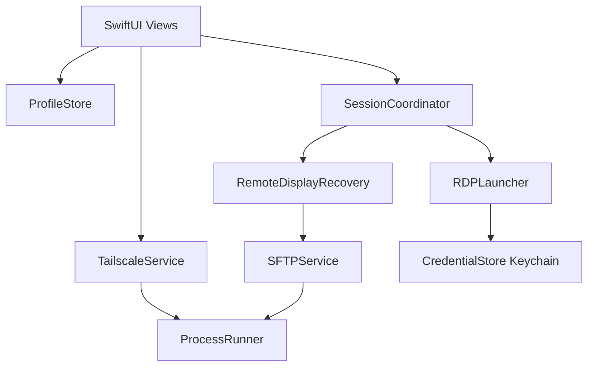

# TailRDP Handover

Developer reference for the distributable TailRDP app (`app.tailrdp`).

## Architecture



| Layer | Responsibility |
|-------|----------------|
| `TailscaleService` | `tailscale status --json` → peers |
| `ProfileStore` | `profiles.json`, merge discovery, flash banners |
| `RDPLauncher` | Build argv, stdin password, track process |
| `SessionCoordinator` | Connect/heal/classify session end |
| `RemoteDisplayRecovery` | SSH scripts for Linux session state |
| `CredentialStore` | Keychain `app.tailrdp`, JSON migration |

## Conventions

- **Bundle ID / Keychain service:** `app.tailrdp`
- **Profile id:** lowercased hostname or manual display name
- **Min platform:** macOS 15 in `TailRDP.app` Info.plist; SPM `Package.swift` uses `.macOS(.v14)` for Command Line Tools compatibility
- **Distribution v1:** source + `./build.sh` → `dist/TailRDP.app` (unsigned, ad-hoc signed)

## Phased PR map (implemented)

| Phase | Summary |
|-------|---------|
| 0 | Session race fixes, MainActor SSH offload |
| 0.5 | Wizard, all-peer discovery, add/delete host, DependencyChecker, identity |
| 1 | Keychain, `/from-stdin:force`, Apache LICENSE, README |
| 2 | Offline connect, SSH unknown tri-state, narrow pkill |
| 3 | Remote `$HOME`, showOffline, XCTest |
| 4 | build.sh dist, About window, USER_GUIDE, HANDOVER |

## Verify

```sh
swift build
swift test          # requires full Xcode (not Command Line Tools alone)
swift run TailRDP --verify-session
./build.sh
```

## Key files

| File | Notes |
|------|-------|
| `FirstRunWizardView.swift` | 5-step onboarding |
| `DependencyChecker.swift` | Tailscale/FreeRDP/SSH detection |
| `CredentialStore.swift` | Keychain + one-time JSON import |
| `RDPLauncher.swift` | stdin password, freerdp path override |
| `RemoteDisplayRecovery.swift` | `RemoteSessionState` tri-state |
| `PeerSidebar.swift` | Add/delete, offline filter |

## Deferred (not v1)

- GitHub Releases DMG / zip
- Developer ID signing + notarization
- Universal Intel binary
- Profile export/import
- Windows remote pause disconnect (WinRM)
- macOS 14 support

## Limits

- Passwords are Keychain-bound to this Mac and bundle ID.
- SSH optional: RDP-only users skip file transfer and Linux heal.
- All tailnet OS types listed; user must configure RDP only where a server exists.
- Unsigned app requires explicit user trust on first launch.
